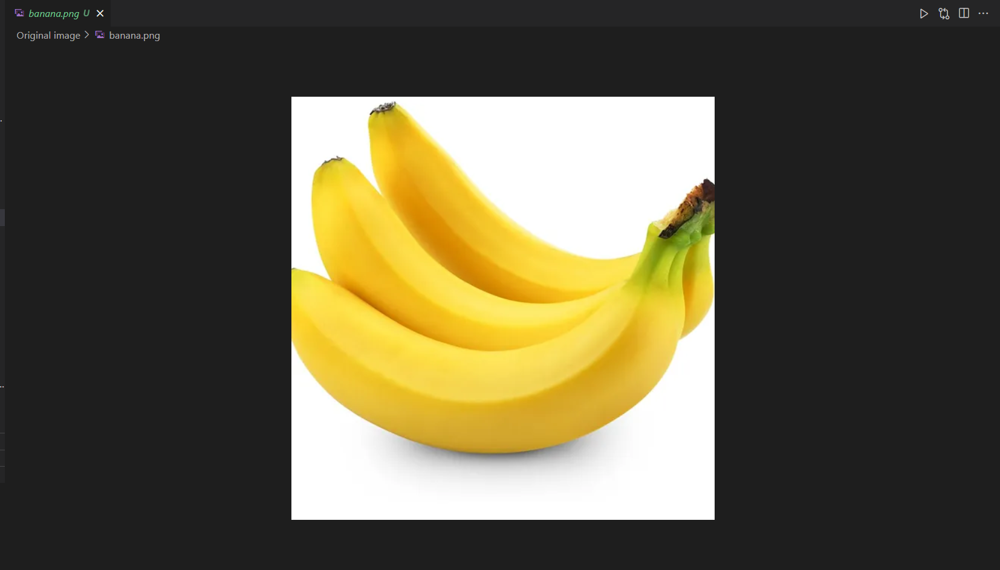
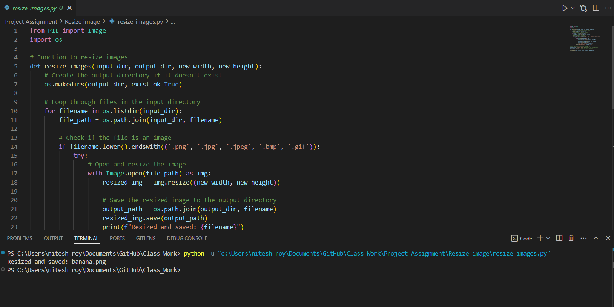
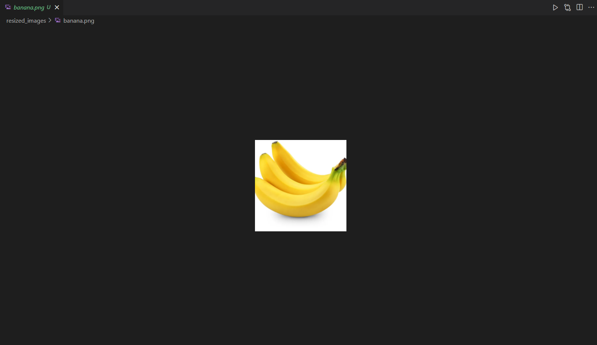

# Image Resizer

A Python script to resize images to specified dimensions using the `Pillow` library.

---

## ✨ Features

- Resize images to custom dimensions.
- Supports multiple image formats (JPG, PNG, BMP, etc.).
- Simple and user-friendly CLI input.

---

## ⚙️ Requirements

- Python 3.x
- `Pillow` library

---

## 🛠 Installation

1. Clone the repository:
   ```bash
   git clone https://github.com/rahul886297/image-resizer.git

2. Navigate to the folder:

```bash
cd image-resizer
```

3. Install dependencies:

```bash
pip install pillow
```

## 🚀 Usage

1. Run the script:
```bash
python image_resizer.py
```

2. Enter the following details when prompted:

- Path to the input image (e.g., example.jpg).
- Path to save the resized image (e.g., resized_example.jpg).
- Desired width and height.

3. The resized image will be saved to the specified output path.

## 📸 Screenshots
### Original Image.


### Run The Code.


### After Resizing Image.


**Author:** [Rahul Mandal](https://github.com/rahul886297) 
